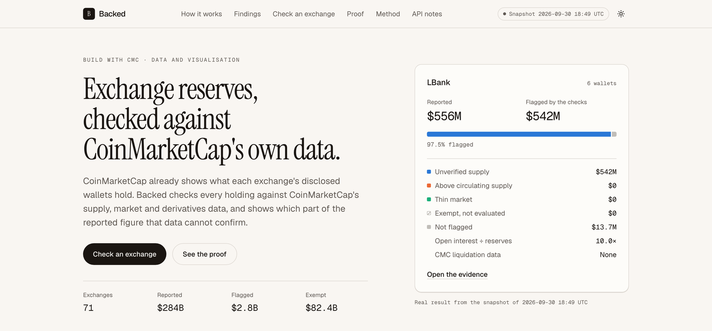
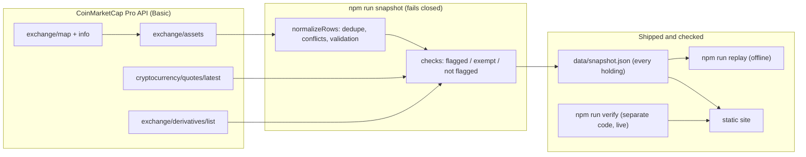

<div align="center">



&nbsp;

[](LICENSE)


### Exchange reserves, checked against CoinMarketCap's own data.

Most reserve trackers answer one question: *how much does this exchange hold?* Backed answers the harder one: **how much of that figure can CoinMarketCap's own data confirm?** It joins every wallet an exchange discloses through the **CoinMarketCap API** with CoinMarketCap's supply, market and derivatives data, flags what that data cannot confirm, and shows no figure at all where there are no wallets to check.

**[ Live ↗ ](https://backed-liart.vercel.app)** · **[ Judge it in 90 seconds ↗ ](#judge-it-in-90-seconds)** · **[ API feedback ↗ ](https://backed-liart.vercel.app/api-notes)** · **[ Method ↗ ](https://backed-liart.vercel.app/method)**

</div>

## ▶ Demo

Demo video: link added at submission.

LBank reports $556M in reserves; CoinMarketCap has not verified the supply of the tokens behind $542M of it. Coinbase is listed as publishing reserves, yet the API returns no wallets, so Backed refuses to show a number. Then the data is tampered with, and the replay fails. Every frame is the live site or a real command.

## Contents

- [The problem I set out to solve](#the-problem-i-set-out-to-solve)
- [What I built](#what-i-built)
- [Judge it in 90 seconds](#judge-it-in-90-seconds)
- [What it finds](#what-it-finds)
- [How I integrated CoinMarketCap](#how-i-integrated-coinmarketcap)
- [Architecture](#architecture)
- [Success and refusal](#success-and-refusal)
- [Engineering decisions](#engineering-decisions)
- [What's real — the honesty table](#whats-real--the-honesty-table)
- [API feedback](#what-the-api-made-possible-and-where-it-got-in-the-way)
- [Run it](#run-it)

## The problem I set out to solve

An exchange's reserve figure is every disclosed wallet balance multiplied by a price. CoinMarketCap already shows that allocation. What nobody puts next to it is CoinMarketCap's own view of the same tokens: whether their supply is verified, whether the exchange holds more than the circulating supply, whether they trade anywhere. A token priced from a single thin market can make a reserve total look far larger than anything that could be sold.

So I treated *"the data behind this figure cannot be confirmed"* as a first-class result, sitting right next to the figure itself, and treated *"there is nothing to check"* as a refusal rather than a zero.

## What I built

1. **Discover.** `/v1/exchange/map` and `/v1/exchange/info` find every exchange CoinMarketCap marks as publishing proof-of-reserves (89 of 978).
2. **Collect.** `/v1/exchange/assets` returns the wallets for 71 of them. Duplicate rows are dropped; conflicting balances are counted, not summed.
3. **Join.** `/v2/cryptocurrency/quotes/latest` adds supply, market pairs, volume and tags for every held token, by CoinMarketCap ID.
4. **Check.** Every holding lands in exactly one bucket: **flagged** (unverified supply, above circulating supply, or thin market), **exempt** (stablecoins and wrapped or staked tokens, not evaluated), or **not flagged**.
5. **Weigh exposure.** `/v5/exchange/derivatives/list` puts futures open interest beside the disclosed reserves.
6. **Prove.** Every holding ships in `data/snapshot.json`. `npm run replay` recomputes all 71 exchanges offline; `npm run verify` re-fetches a sample with separate code and fails on any difference.

## Judge it in 90 seconds

No key needed for the first two:

```bash
# 1. Open the live evidence for the largest case
open https://backed-liart.vercel.app/exchange/lbank

# 2. Recompute every exchange from the shipped data, offline
git clone https://github.com/Cassxbt/backed && cd backed && npm install
npm run replay
# PASS 71 exchanges replayed from 2026-09-30T18:49:30.173Z (checks-v4)

# 3. Tamper with it and watch it fail
node -e "const f='data/snapshot.json',s=require('./'+f);s.exchanges[0].passedUsd+=1e6;require('fs').writeFileSync(f,JSON.stringify(s))"
npm run replay   # FAIL, exit 1
git checkout data/snapshot.json
```

With a free CoinMarketCap key, `npm run verify` re-fetches 7 exchanges and recomputes them without the checks module. It exits non-zero if an exchange is missing or any figure differs by more than 1%. At 18:50 UTC it matched this snapshot within 0.14%.

## What it finds

Snapshot of 2026-09-30, 18:47 to 18:49 UTC, method `checks-v4`, 111 calls and 111 credits on the free Basic plan.

| | |
|---|---|
| Exchanges with wallet-level reserves in the API | **71**. Another 18 are listed as reporting but return no wallets, including every exchange CoinMarketCap marks as audited |
| Reported reserves | **$284.4B** |
| Flagged by the checks | **$2.85B**, 83% of it tokens with unverified supply. The largest single flag is USDZ at Blockfinex, $1.38B |
| Exempt, not evaluated | **$82.4B** (29%): stablecoins and wrapped or staked tokens |
| More open interest than disclosed reserves | **33 of 52** exchanges with data: $107.6B of open interest on $17.2B of reserves |
| Above 10× | **21** exchanges, $79.2B on $2.1B. Ratios are largest where disclosed reserves are small |
| CoinMarketCap liquidation data | 6 of the 71 exchanges, and 1 of the 33 above 1× |

- **LBank** reports $556M; 97.5% sits in tokens whose circulating supply CoinMarketCap has not verified. The largest is UMM: 98.9M tokens in one wallet, one market pair, `circulating_supply: 0`.
- **MEXC** discloses 3.6 times CoinMarketCap's circulating-supply figure for MX. The $452M above it is flagged as a supply discrepancy; the datasets can differ in scope or timing, and ownership cannot be inferred from it.
- **WEEX** reports $226M of reserves and $11.3B of open interest (50×).
- **Binance and OKX** have $8.1M and $7.5M flagged, under 0.1% of $173B and $21B, and about a third of each is exempt. Not flagged is not the same as verified.

## How I integrated CoinMarketCap

Backed has no data of its own. Remove the CoinMarketCap API and there is no wallet list, no supply to compare against and no exposure to weigh.

| Endpoint | Role in the mechanism | Calls per refresh |
|---|---|---|
| `GET /v1/exchange/map` | Every active exchange (978); the run stops if the list hits the page limit | 1 |
| `GET /v1/exchange/info` | `porStatus`, `porAuditStatus`, spot volume, 100 exchanges per call | 10 |
| `GET /v1/exchange/assets` | Wallet-level reserves, the input to every check | 89 |
| `GET /v2/cryptocurrency/quotes/latest` | `circulating_supply`, `self_reported_circulating_supply`, `num_market_pairs`, tags, volume; 100 tokens per call | 9 |
| `GET /v5/exchange/derivatives/list` | `open_interest_usd` per exchange | 1 |
| `GET /v5/derivatives/liquidations/exchange/list/latest` | Which exchanges CoinMarketCap has liquidation data for | 1 |

Every endpoint works on the free Basic plan, so the live site and every command keep working after event access ends.

A real call, the UMM row behind LBank's largest flag (captured 2026-09-29 04:43 UTC, trimmed to the fields Backed reads):

```bash
curl -H "X-CMC_PRO_API_KEY: $CMC_PRO_API_KEY" "https://pro-api.coinmarketcap.com/v1/exchange/assets?id=333"
```

```json
{ "wallet_address": "0x873F3EE008AD7d5bb37043186db7503B57D68F75",
  "platform": { "symbol": "AVAX", "crypto_id": 5805 },
  "currency": { "symbol": "UMM", "crypto_id": 32587, "price_usd": 4.023144339181496 },
  "balance": 98899479.0 }
```

```bash
curl -H "X-CMC_PRO_API_KEY: $CMC_PRO_API_KEY" "https://pro-api.coinmarketcap.com/v2/cryptocurrency/quotes/latest?id=32587"
```

```json
{ "id": 32587, "symbol": "UMM", "circulating_supply": 0,
  "self_reported_circulating_supply": 100000000, "total_supply": 100000000,
  "num_market_pairs": 1,
  "quote": { "USD": { "price": 4.013309700410941, "market_cap": 0, "volume_24h": 180276.30655168 } } }
```

## Architecture



The key never reaches the browser: the site is built statically from `data/`.

## Success and refusal

| Case | What Backed does |
|---|---|
| LBank, $556M reported | Flags $542M as unverified supply and shows the CoinMarketCap fields and wallets behind each flag |
| Binance, $173B reported | Flags $8.1M, marks a third as exempt, and says not flagged is not verified |
| Coinbase, Kraken and 16 others | CoinMarketCap lists them as reporting, the API returns no wallets: **no figure is shown** |
| A request fails during a refresh | The run aborts and nothing is written, so a partial set is never published |
| A stored total or holding is edited | `npm run replay` fails with the mismatch and exits 1 |
| Verify runs against a different snapshot | The site drops the verified line |

## Engineering decisions

- **Exempt is not passing.** Stablecoins and wrapped or staked tokens get their value from redemption, which market data cannot test. They were 29% of reported value; counting them as passing would have made most exchanges look cleaner than the data supports.
- **Fail closed everywhere.** A failed request, a negative balance or a truncated exchange list stops the snapshot. A verify run that cannot find an exchange fails rather than shrinking its sample.
- **Zero open interest is missing data.** CoinMarketCap reports exactly 0 for exchanges with billions in derivatives volume, so 0 is treated as no data, and the site says so.
- **Conflicting balances are counted, not summed.** When one wallet and token come back with two balances, the larger is kept and the conflict is shown.
- **Verify does not share code with the checks.** It reimplements the rules separately, so a bug in `checks.ts` cannot confirm itself.
- **Never fake a number.** Every figure on the site, in this README and in the demo comes from one snapshot, and the API notes cite the call and time behind each item.

## What's real — the honesty table

| Capability | Status |
|---|---|
| Wallet, supply, open-interest and liquidation data | **Real.** Live CoinMarketCap API, Basic plan |
| Figures on the site | **Real.** One snapshot, replayable offline |
| Independent recompute | **Real.** `npm run verify`, 7 exchanges, fails above 1% |
| Wallet balances checked on-chain | **Not done.** Taken from CoinMarketCap as returned; CoinMarketCap states it does not verify them |
| Wallets under $100,000 | **Not visible.** CoinMarketCap lists only wallets at or above $100,000 |
| Balance freshness | **Not measurable.** Reserve rows carry no timestamp; the documentation says balances may be delayed |
| Solvency, backing or ownership | **Not claimed.** The data has no liabilities |
| Market depth | **Proxy only.** Pair count; `market-pairs/latest` is not on the Basic plan |
| Change over time | **Not built.** History is recorded from 2026-09-30; no change analysis is claimed |

## What the API made possible, and where it got in the way

It made possible: wallet-level reserves with prices from one endpoint, verified supply next to self-reported supply, and open interest per exchange, all on the Basic plan at 111 credits per full refresh.

Where it got in the way. The [API notes page](https://backed-liart.vercel.app/api-notes) gives the exact call and capture time for each item, computed from `data/snapshot.json` and `data/evidence.json` (`npm run evidence` recaptures them):

1. Every exchange marked as audited returns no wallets from `exchange/assets`.
2. Reserve totals count tokens with unverified supply at full price; this is 83% of what Backed flags.
3. Binance's USDS rows are mapped to crypto_id 33452 (TheStandard USD) instead of 33039 (USDS).
4. Reserve rows carry no timestamp, so the documented delay cannot be measured.
5. 18 of Binance's 30 legacy Bitcoin addresses come back lowercased, which breaks base58 lookups.
6. Responses contain duplicate rows, and some wallet and token pairs come back with two different balances.
7. `open_interest_usd` is exactly 0 for exchanges with billions in derivatives volume, and which ones changes between refreshes.
8. WOO X Pro BTC/USD reports about $12.1 trillion of open interest, with `outlier_detected: false`.
9. `funding_rate` has no settlement interval.
10. `market-pairs/latest`, which would give real depth, is not on the Basic plan.

## Run it

```bash
npm install
npm test            # 33 tests, including replay and tamper cases
npm run replay      # offline, no key
echo "CMC_PRO_API_KEY=your-key" > .env.local
npm run snapshot    # about 2.5 minutes, 111 credits; writes nothing on any failure
npm run verify      # about 20 credits
npm run dev
```

```
scripts/cmc.ts        API client: rate limit, timeouts, retries, call log
scripts/snapshot.ts   pipeline: map → info → assets → quotes → derivatives
scripts/verify.ts     live recompute with separate code
scripts/replay.ts     offline recompute of every exchange
scripts/evidence.ts   captures the API-note reproductions
src/lib/checks.ts     the checks, pure functions
src/lib/rows.ts       duplicate and conflict handling, input validation
src/app/              overview, exchange pages, method, API notes
```

---

Built for **Build with CMC: API Hackathon** · Data and Visualisation track · `#BuildwithCMC` · MIT license
