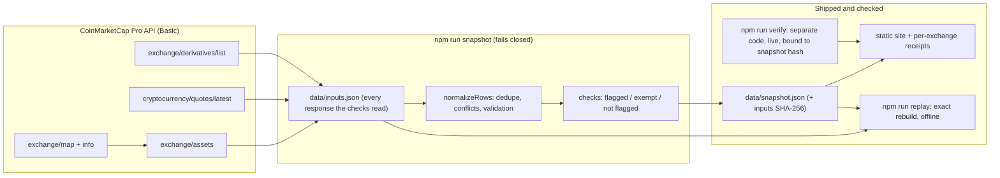

<div align="center">


&nbsp;

[](LICENSE)


### Exchange reserves, checked against CoinMarketCap's own data.

Most reserve trackers answer one question: *how much does this exchange hold?* Backed answers the harder one: **how much of that figure can CoinMarketCap's own data confirm?** It joins every wallet an exchange discloses through the **CoinMarketCap API** with CoinMarketCap's supply, market and derivatives data, flags what that data cannot confirm, and shows no figure at all where there are no wallets to check.

**[ Live ↗ ](https://backed-liart.vercel.app)** · **[ Demo video ↗ ](https://youtu.be/CFoywNgtyeo)** · **[ Judge it in 90 seconds ↗ ](#judge-it-in-90-seconds)** · **[ API feedback ↗ ](https://backed-liart.vercel.app/api-notes)** · **[ Method ↗ ](https://backed-liart.vercel.app/method)**

</div>

## ▶ Demo

**[Watch the 2½-minute demo ↗](https://youtu.be/CFoywNgtyeo)**

LBank reports $559M in reserves; CoinMarketCap has not verified the supply of the tokens behind $545M of it. Coinbase is listed as publishing reserves, yet the API returns no wallets, so Backed refuses to show a number. Then the data is tampered with, and the replay fails. Every product shot is the live site, and every terminal line is real command output.

## Contents

- [The problem I set out to solve](#the-problem-i-set-out-to-solve)
- [What I built](#what-i-built)
- [Judge it in 90 seconds](#judge-it-in-90-seconds)
- [What it finds](#what-it-finds)
- [How I integrated CoinMarketCap](#how-i-integrated-coinmarketcap)
- [Architecture](#architecture)
- [Success and refusal](#success-and-refusal)
- [Engineering decisions](#engineering-decisions)
- [What's real — the honesty table](#whats-real--the-honesty-table)
- [API feedback](#what-the-api-made-possible-and-where-it-got-in-the-way)
- [Run it](#run-it)

## The problem I set out to solve

An exchange's reserve figure is every disclosed wallet balance multiplied by a price. CoinMarketCap already shows that allocation. What nobody puts next to it is CoinMarketCap's own view of the same tokens: whether their supply is verified, whether the exchange holds more than the circulating supply, whether they trade anywhere. A token priced from a single thin market can make a reserve total look far larger than anything that could be sold.

So I treated *"the data behind this figure cannot be confirmed"* as a first-class result, sitting right next to the figure itself, and treated *"there is nothing to check"* as a refusal rather than a zero.

## What I built

1. **Discover.** `/v1/exchange/map` and `/v1/exchange/info` find every exchange CoinMarketCap marks as publishing proof-of-reserves (89 of 978).
2. **Collect.** `/v1/exchange/assets` returns the wallets for 71 of them. Duplicate rows are dropped; conflicting balances are counted, not summed.
3. **Join.** `/v2/cryptocurrency/quotes/latest` adds supply, market pairs, volume and tags for every held token, by CoinMarketCap ID.
4. **Check.** Every holding lands in exactly one bucket: **flagged** (unverified supply, above circulating supply, or thin market), **exempt** (stablecoins and wrapped or staked tokens, not evaluated), or **not flagged**.
5. **Weigh exposure.** `/v5/exchange/derivatives/list` puts futures open interest beside the disclosed reserves.
6. **Prove.** `data/inputs.json` keeps every wallet row exactly as returned, plus the supply, market, open-interest and liquidation fields the checks read; its SHA-256 is recorded in `data/snapshot.json`. `npm run replay` rebuilds the snapshot from those inputs offline and fails unless every field matches exactly. `npm run verify` re-fetches a sample live, recomputes it with separate code, and binds its result to the snapshot's hash. Each exchange page offers a receipt that replays on its own.

## Judge it in 90 seconds

No key needed for the first two:

```bash
# 1. Open the live evidence for the largest case
open https://backed-liart.vercel.app/exchange/lbank

# 2. Rebuild the snapshot from the captured API responses, offline
git clone https://github.com/Cassxbt/backed && cd backed && npm install
npm run replay
# PASS snapshot rebuilt exactly from inputs f364f27db8ce: 71 exchanges, 18 without wallets, 111 calls (checks-v6)

# 3. Tamper with any stored result and watch it fail
node -e "const f='data/snapshot.json',s=require('./'+f);s.exchanges[0].holdings.find(h=>h.exempt).exempt=false;require('fs').writeFileSync(f,JSON.stringify(s))"
npm run replay   # FAIL, names the field, exit 1
git checkout data/snapshot.json

# 4. Replay one exchange from its receipt
curl -sO https://backed-liart.vercel.app/exchange/lbank/receipt.json
npm run replay -- receipt.json
```

With a free CoinMarketCap key, `npm run verify` re-fetches 8 exchanges and recomputes them without the checks module. It exits non-zero if an exchange is missing or any figure differs by more than 1%. At 21:36 UTC it matched this snapshot within 0.11%.

## What it finds

Snapshot of 2026-09-30, 21:31 to 21:34 UTC, method `checks-v6`, 111 calls and 111 credits on the free Basic plan.

| | |
|---|---|
| Exchanges with wallet-level reserves in the API | **71**. Another 18 are listed as reporting but return no wallets, including every exchange CoinMarketCap marks as audited |
| Reported reserves | **$284.3B** |
| Flagged by the checks | **$2.85B**, 83% of it tokens with unverified supply. The largest single flag is USDZ at Blockfinex, $1.38B |
| Exempt, not evaluated | **$82.4B** (29%): stablecoins and wrapped or staked tokens |
| More open interest than disclosed reserves | **33 of 52** exchanges with data: $108.3B of open interest on $17.1B of reserves |
| Above 10× | **20** exchanges, $74.1B on $1.5B. Ratios are largest where disclosed reserves are small |
| In CoinMarketCap's latest liquidation list | 6 of the 71 exchanges, and 1 of the 33 above 1×. The list leaves out exchanges without an integrated feed and those with no recent liquidations, so absence proves neither |

- **LBank** reports $559M; 97.5% sits in tokens whose circulating supply CoinMarketCap has not verified. The largest is UMM: 98.9M tokens in one wallet, one market pair, `circulating_supply: 0`.
- **MEXC** discloses 3.6 times CoinMarketCap's circulating-supply figure for MX. The $452M above it is flagged as a supply discrepancy; the datasets can differ in scope or timing, and ownership cannot be inferred from it.
- **WEEX** reports $225M of reserves and $11.2B of open interest (50×).
- **Binance and OKX** have $8.0M and $7.5M flagged, under 0.1% of $173B and $21B, and about a third of each is exempt. Not flagged is not the same as verified.

## How I integrated CoinMarketCap

Backed has no data of its own. Remove the CoinMarketCap API and there is no wallet list, no supply to compare against and no exposure to weigh.

| Endpoint | Role in the mechanism | Calls per refresh |
|---|---|---|
| `GET /v1/exchange/map` | Every active exchange (978); the run stops if the list hits the page limit | 1 |
| `GET /v1/exchange/info` | `porStatus`, `porAuditStatus`, spot volume, 100 exchanges per call | 10 |
| `GET /v1/exchange/assets` | Wallet-level reserves, the input to every check | 89 |
| `GET /v2/cryptocurrency/quotes/latest` | `circulating_supply`, `self_reported_circulating_supply`, `num_market_pairs`, tags, volume; 100 tokens per call | 9 |
| `GET /v5/exchange/derivatives/list` | `open_interest_usd` per exchange | 1 |
| `GET /v5/derivatives/liquidations/exchange/list/latest` | Which exchanges appear in the latest liquidation list | 1 |

Every endpoint above was run on a free Basic key, so the live site and every command keep working after event access ends.

A real call, the UMM row behind LBank's largest flag (captured 2026-09-29 04:43 UTC, trimmed to the fields Backed reads):

```bash
curl -H "X-CMC_PRO_API_KEY: $CMC_PRO_API_KEY" "https://pro-api.coinmarketcap.com/v1/exchange/assets?id=333"
```

```json
{ "wallet_address": "0x873F3EE008AD7d5bb37043186db7503B57D68F75",
  "platform": { "symbol": "AVAX", "crypto_id": 5805 },
  "currency": { "symbol": "UMM", "crypto_id": 32587, "price_usd": 4.023144339181496 },
  "balance": 98899479.0 }
```

```bash
curl -H "X-CMC_PRO_API_KEY: $CMC_PRO_API_KEY" "https://pro-api.coinmarketcap.com/v2/cryptocurrency/quotes/latest?id=32587"
```

```json
{ "id": 32587, "symbol": "UMM", "circulating_supply": 0,
  "self_reported_circulating_supply": 100000000, "total_supply": 100000000,
  "num_market_pairs": 1,
  "quote": { "USD": { "price": 4.013309700410941, "market_cap": 0, "volume_24h": 180276.30655168 } } }
```

## Architecture



The key never reaches the browser: the site is built statically from `data/`.

## Success and refusal

| Case | What Backed does |
|---|---|
| LBank, $559M reported | Flags $545M as unverified supply and shows the CoinMarketCap fields and wallets behind each flag |
| Binance, $173B reported | Flags $8.0M, marks a third as exempt, and says not flagged is not verified |
| Coinbase, Kraken and 16 others | CoinMarketCap lists them as reporting, the API returns no wallets: **no figure is shown** |
| A request fails, or returns a 200 that is not a well-formed CoinMarketCap envelope | The run aborts and nothing is written, so a partial set or an empty body is never published as "no wallets" |
| Any stored result is edited: a total, a holding's flag or exemption, open interest, the ratio, the exchange list | `npm run replay` rebuilds the snapshot from the inputs, names the first differing fields, and exits 1 |
| The inputs are edited | The SHA-256 no longer matches the snapshot and replay fails. If someone edits the inputs and regenerates everything consistently, replay cannot tell; only `npm run verify` against the live API can, for the exchanges it samples |
| An unknown method version, an empty or duplicated exchange list, or an exchange with no logged assets call | Replay rejects the inputs before rebuilding |
| Verify ran against different snapshot bytes | The site drops the verified line |

## Engineering decisions

- **Exempt is not passing.** Stablecoins and wrapped or staked tokens get their value from redemption, which market data cannot test. They were 29% of reported value; counting them as passing would have made most exchanges look cleaner than the data supports.
- **Fail closed everywhere.** A failed request, a malformed response, a negative balance, or an exchange or derivatives list at its page limit stops the snapshot. A verify run that cannot find an exchange fails rather than shrinking its sample.
- **Zero open interest is kept but not used.** CoinMarketCap reports exactly 0 for exchanges with billions in derivatives volume. The reported 0 is kept in the inputs and shown as "reported as $0, treated as unavailable"; it never produces a ratio.
- **Conflicting rows are counted, not summed.** When one wallet and token come back with different balances or prices, the larger balance (then the higher price) is kept whatever order the rows arrive in, and the conflict is shown.
- **Replay proves derivation, verify tests the source.** Replay shows the published figures are exactly what the method computes from the captured inputs. It cannot show the inputs are what CoinMarketCap served, or re-derive which exchanges report reserves. Verify checks 8 exchanges against the live API; `data/verify.json` is only a record of whoever last ran it, so run it with your own key.
- **Verify does not share code with the checks.** It reimplements the rules separately, so a bug in `checks.ts` cannot confirm itself.
- **Never fake a number.** Every exchange figure on the site, in this README and in the demo comes from one snapshot. API notes that need other endpoints come from dated captures in `data/evidence.json`, and each cites its call and time.

## What's real — the honesty table

| Capability | Status |
|---|---|
| Wallet, supply, open-interest and liquidation data | **Real.** Live CoinMarketCap API, Basic plan |
| Figures on the site | **Real.** One snapshot, rebuilt exactly from its captured inputs offline |
| Independent recompute | **Real.** `npm run verify`, 8 exchanges, fails above 1% |
| Wallet balances checked on-chain | **Not done.** Taken from CoinMarketCap as returned; CoinMarketCap states it does not verify them |
| Wallets under $100,000 | **Not visible.** CoinMarketCap lists only wallets at or above $100,000 |
| Balance freshness | **Not measurable.** Reserve rows carry no timestamp; the documentation says balances may be delayed |
| Solvency, backing or ownership | **Not claimed.** The data has no liabilities |
| Market depth | **Proxy only.** Pair count; `market-pairs/latest` is not on the Basic plan |
| Change over time | **Not built.** History is recorded from 2026-09-30; no change analysis is claimed |

## What the API made possible, and where it got in the way

It made possible: wallet-level reserves with prices from one endpoint, verified supply next to self-reported supply, and open interest per exchange, all on the Basic plan at 111 credits per full refresh.

Where it got in the way. The [API notes page](https://backed-liart.vercel.app/api-notes) gives the source of each item: the snapshot, a dated capture in `data/evidence.json` (`npm run evidence` recaptures them), or the documentation. An item whose evidence stops holding drops off the page.

1. Every exchange marked as audited returns no wallets from `exchange/assets`.
2. Reserve totals count tokens with unverified supply at full price; this is 83% of what Backed flags.
3. Binance's USDS rows carry crypto_id 33452 (TheStandard USD) at 39 times that token's circulating supply, a possible identity mismatch with USDS (33039).
4. Reserve rows carry no timestamp, so the documented delay cannot be measured.
5. 18 of Binance's 30 legacy Bitcoin addresses come back entirely lowercase, and all 18 fail the Base58Check checksum as returned.
6. Responses contain duplicate rows, and some wallet and token pairs come back with different balances or prices.
7. `open_interest_usd` is exactly 0 for 11 derivatives exchanges, including one with $8.1B of 24h derivatives volume.
8. WOO X Pro BTC/USD reports $14.7 trillion of open interest, 5.1 times CoinMarketCap's own total market cap, with `outlier_detected: false`.
9. 188 of 190 BTC derivatives pairs carry `funding_rate`, and no field gives its interval.
10. Both market-pair depth endpoints return HTTP 403, error 1006, on a Basic key.

## Run it

```bash
npm install
npm test            # 75 tests, including replay, receipt and tamper cases
npm run replay      # offline, no key; npm run replay -- receipt.json for one exchange
echo "CMC_PRO_API_KEY=your-key" > .env.local
npm run snapshot    # about 3 minutes, 111 credits; writes nothing on any failure
npm run verify      # about 20 credits
npm run dev
```

```
scripts/cmc.ts        API client: strict envelope, rate limit, timeouts, retries, call log
scripts/snapshot.ts   capture: map → info → assets → quotes → derivatives → data/inputs.json
scripts/verify.ts     live recompute with separate code
scripts/replay.ts     exact offline rebuild of the snapshot, or of one receipt
scripts/evidence.ts   captures the API-note reproductions
src/lib/build.ts      inputs → snapshot, a pure function
src/lib/checks.ts     the checks, pure functions
src/lib/rows.ts       duplicate and conflict handling, input validation
src/app/              overview, exchange pages, method, API notes
```

---

Built for **Build with CMC: API Hackathon** · Data and Visualisation track · `#BuildwithCMC` · MIT license
